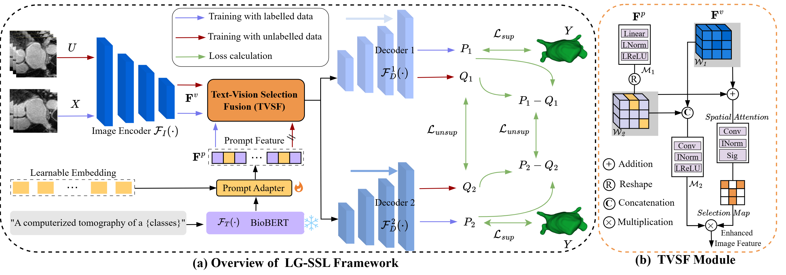

# Universal-Medical-SSL
This repo is the official implementation of  [Language-Guided Visual Representation Learning for Medical Images]().

<p align="center">

</p>

-------

##  Abstract

Semi-Supervised Learning (SSL) significantly reduces the demand for medical segmentation annotations by learning from unlabeled images. Currently, most methods do not explicitly learn from unlabeled data, which may lead to suboptimal semantic feature representations of the target. Recently, vision-language models have achieved impressive results in enhancing fine-grained semantic segmentation through textual knowledge. However, how to utilize text prompt during training to learn consistent semantic representations for medical unlabeled data remains a challenge. To address the above issues, we propose a Semi-Supervised Learning paradigm for Language-Guided visual representation learning (LG-SSL) to fully learn from unlabeled data.


Specifically, we first construct a learnable prompt adapter to obtain the mapping relationship between the text and image space of the prompt target through supervised learning. Then, we use the text prompts learned from labeled data to guide the network’s perception of target features in unlabeled data. At the same time, we propose a Text-Vision Selection Fusion module to combine effective semantics by fusing and selecting text and visual features. Furthermore, we introduce a hybrid consistency constraint strategy, enhancing the network’s capacity to learn complex representations by combining consistency in perturbation predictions and diversity in unified predictions.Experimental results demonstrate that our proposed method outperforms other state-of-the-art methods on four datasets with diverse modalities. We have integrated a unified semi-supervised learning segmentation platform:[Universal-Medical-SSL](https://github.com/Lry777/Universal-Medical-SSL).

-------

##  Usage

### 1.Environment

First, clone the repo:

```shell
git 
cd
```

Then, create a new environment and install the requirements:
```shell
conda create -n LG-SSL python=3.8
cd LG-SSL/


```
### 2.Data Preprocessing

#### 2.1 Dataset 2-Class Left Atrium

Download the dataset with :
```shell
```
#### 2.2 Dataset 2-Class Pancreas-CT
#### 2.3 Dataset Multi-class BTCV
#### 2.4 Dataset Multi-class LiTS

Then your file structure will be like:

```
```
Next, process the data.

```

```

-------

### 3.Training

```bash

```
-------

### 4.Evaluating

```
```

-------

### 5.Benchmark and model

Results and models are available in the [model]().

<div>
  <b>Universal-Medical-SSL</b>
</div>
<table>
  <tbody>
    <tr align="center" valign="center">
      <td>
        <b>Supported models</b>
      </td>
      <td>
        <b>Supported datasets</b>
      </td>
    </tr>
    <tr valign="top">
      <td>
        <ul>
          <li><a href="https://github.com/jingkunchen/TAC">TAC (TMI'2023)</a></li>
          <li><a href="https://github.com/yulequan/UA-MT">UA-MT (MedIA'2023)</a></li>
          <li><a href="https://github.com/HengCai-NJU/DeSCO">DeSCO (CVPR'2023)</a></li>
          <li><a href="https://github.com/WYC-321/MCF">MCF (CVPR'2023)</a></li>
          <li><a href="https://github.com/himashi92/Co-BioNet">Co-BioNet (NMI'2023)</a></li>
          <li><a href="https://github.com/lemoshu/AC-MT">AC-MT (MedIA'2023)</a></li>
          <li><a href="https://github.com/ycwu1997/MC-Net">MC-Net+ (MedIA'2022)</a></li>
          <li><a href="https://github.com/Herschel555/CAML">CLAM (MICCAI'2023)</a></li>
          <li><a href="https://github.com/Lry777/Universal-Medical-SSL">LG-SSL ()</a></li>
        </ul>
      </td>
      <td>
        <ul>
          <li><a href="">2-Class Left Atrium</a></li>
          <li><a href="">2-Class Pancreas-CT</a></li>
          <li><a href="">Multi-class BTCV</a></li>
          <li><a href="">Dataset Multi-class LiTS</a></li>
        </ul>
      </td>
  </tbody>
</table>

-------
   
### 6.Results

#### 6.1 Results of 2-Class Left Atrium Segmentation Task
#### 6.2 Results of 2-Class Pancreas-CT Segmentation Task
#### 6.3 Results of Multi-class BTCV Segmentation Task
#### 6.4 Results of Multi-class LiTS Segmentation Task

